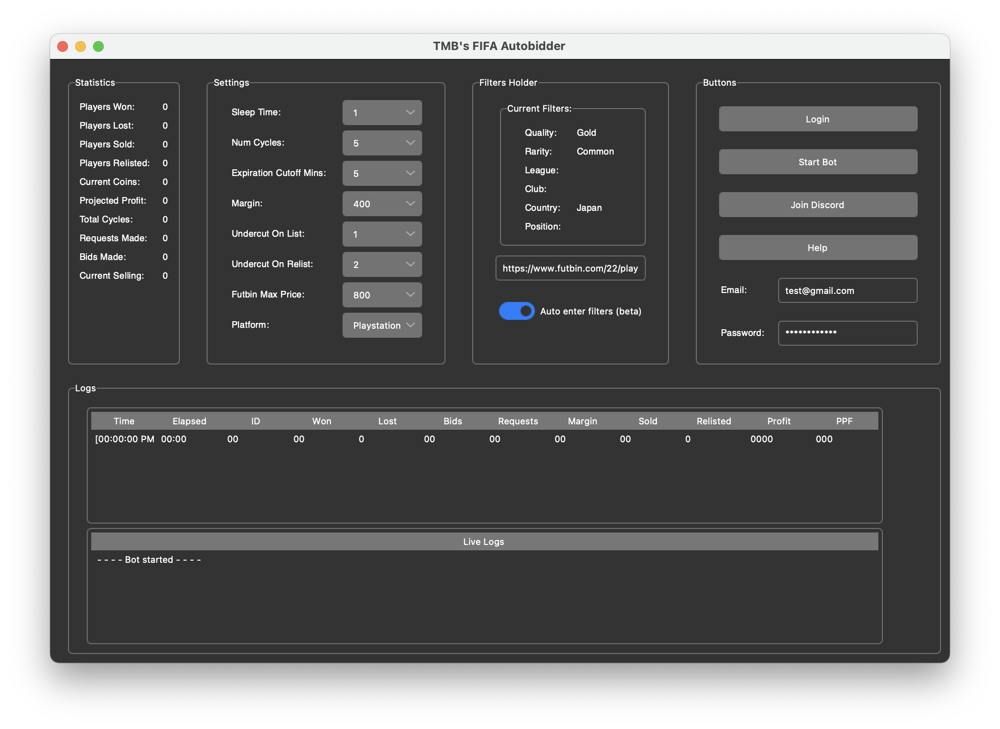
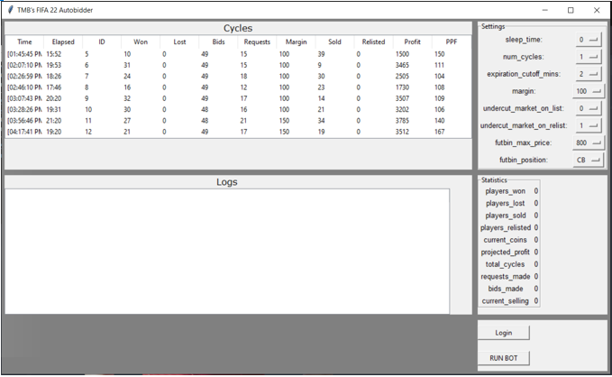

# TMB's FIFA 23 Autobidder

Mac             |   .
:-------------------------:|:-------------------------:
  |  


[](https://discord.gg/3ZuA9w6Szk)

## Intro

This project is an Autobidder trading bot that buys and sells players on the FUT (FIFA 22 Ultimate Team) Transfer Market web application. 

Built in Python, this bot uses [Selenium](https://www.selenium.dev/documentation/en/) to interact with FUT Webapp via [ChromeDriver](https://www.chromium.org/) and features a [Tkinter](https://wiki.python.org/moin/TkInter) User Interface for easy operation.

See [*technical overiew*](https://tmb5cg.github.io/fifa-autobidder) for detailed documentation. For issues/questions, consider joining Discord server [here.](https://discord.gg/3ZuA9w6Szk)


## Overview & Features

Unlike the more common and widely known botting methods, such as [Autobuyers or snipers](https://github.com/chithakumar13/Fifa21-AutoBuyer) that rely on speed and luck (and risky JavaScript injection), Autobidding relies on lower margins at higher volumes (around 100 - 200 coins per card). This makes Autobidding not only more lucrative long term, but also more consistent, and in my opinion, safer. It is also more fun to watch compared to card sniping.

Advantages:

- Consistent profits
  - Does not rely on luck, more importantly not competing with other bots (imagine how many bots just searched for Ronaldo as you read this)
- Efficiency
  - Supply of undervalued auctions is infinitely greater than snipes
- Detectability
  - Selenium's JS injection in itself is no different than a typical browser extension's injected JS, like an Adblocker

For detailed documentation on configuring the bot, [see here](https://tmb5cg.github.io/fifa-autobidder). For issues or support, join our Discord community [here](https://discord.gg/3ZuA9w6Szk).

## Installation

1. Download or clone this repository to your machine, the unzipped folder should be named Fifa22-Autobidder-main. 

2. Ensure Python 3.x is installed on your machine. See [*Troublehoosting*](#troubleshooting) below for help.

3. Download the latest release of Chromedriver for your system [here](https://chromedriver.chromium.org/downloads). Replace the chromedriver in either the [*chrome_windows*](https://github.com/tmb5cg/Fifa22-Autobidder/tree/main/chrome_windows) or [*chrome_mac*](https://github.com/tmb5cg/Fifa22-Autobidder/tree/main/chrome_mac) with your download, depending on your machine.

4. Navigate to the project's root directory via Terminal or Command Prompt, in this example it is on my Desktop.

  Terminal (Mac):

  ```
  cd ~/Desktop/Fifa22-Autobidder-main
  ```

  Command Prompt (Windows):
  ```
  cd Desktop/Fifa22-Autobidder-main
  ```

5. Make sure pip is installed ([see here](https://pip.pypa.io/en/stable/installing/)) on your machine, and enter the following to install Selenium and any other requirements (see [requirements.txt](./requirements.txt)): 

```
pip install -r requirements.txt
```

If there are any errors, such as 'missing xyz module', simply ```pip install [xyz]```. Feel free to post an issue on this Repository or Discord.

For any other errors, it is likely your system's Python interpreter which can be a huge headache. See [*Troublehoosting*](#troubleshooting) below.

## Running the bot

Navigate to the project's root directory via command prompt / terminal described above and assuming the folder is on your Desktop:

#### Linux/Mac

In Terminal, run:

```
cd ~/Desktop/Fifa22-Autobidder-main
```

Then:

```
make run
```

See [*Troublehoosting*](#troubleshooting) for help.

#### Windows

In Command Prompt (Windows), enter:
```
cd Desktop/Fifa22-Autobidder-main
```

Then:

```
python src/run.py
```

See [*Troublehoosting*](#troubleshooting) for help.

The webapp should open in a new browser, along with the GUI.

1. Accept the prompt to install Adblocker.
2. Login, either automatically (and fetch code manually) or entirely manually
3. Enter filter URL in the GUI and make sure it was processed correctly (you will see the filters populate) 
4. Go to the "Search the Transfer Market" page and click "Start Bot" 

To understand how it works and the configuration settings, [see here](https://tmb5cg.github.io/fifa-autobidder)

You want to have a conversion rate around 50%, at 100-150 margin that is 25 players * ~125 profit each, totalling ~3200 coins every 20 mins, or about 10k an hour at the absolute minimum. Some days I would find a filter list and make 30k an hour, it's fun.

## Configuration

Everything is configured via the user interface. [See here](https://tmb5cg.github.io/fifa-autobidder) for an explanation of the user interface settings.

The bot uses Xbox prices by default. To switch your platform, be sure to edit the Platform dropdown on the UI.


## Troubleshooting

### Python

Python 3.7 or greater is required to run the program. The most likely cause for errors is having an outdated Python version installed. To see your version of Python:

##### Mac

Open Terminal and type:

```
python --version
```

##### Windows

Open Command Prompt and type:

```
python --version
```

If you see Python 2.x, see [here](https://docs.python-guide.org/starting/install3/osx/) for installing Python 3.

If you know you have Python 3 installed, but see 2.x, your system's Python PATH must be assigned to Python 3.x. To do this, see [here](https://dev.to/malwarebo/how-to-set-python3-as-a-default-python-version-on-mac-4jjf) for Mac and [here](https://stackoverflow.com/questions/3701646/how-to-add-to-the-pythonpath-in-windows-so-it-finds-my-modules-packages) for Windows.

You might need to add the PYTHONPATH variable with the value of the code directory - [check this link](https://stackoverflow.com/questions/3701646/how-to-add-to-the-pythonpath-in-windows-so-it-finds-my-modules-packages).


I suspect this will cause the biggest number of issues.

### Chomedriver

If the bot is correctly starting, and you are sure Python is not the issue, then Chromedriver is the issue. The Chromedriver files ([chrome_windows](./chrome_windows) and [chrome_mac](./chrome_mac)) are the versions used by my system. 

In order for Chromedriver to work, it must match your systems version of Chrome. This can easily be fixed by redownloading Chromedriver.

Go [here](https://chromedriver.chromium.org/downloads) and download the latest release. Replace the chromedriver in either the *chrome_windows* or *chrome_mac* with your download.


