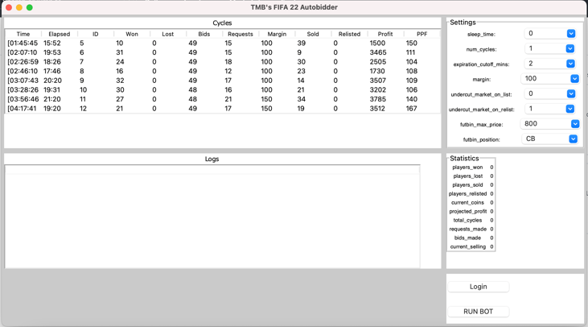

# TMB's FIFA 22 Autobidder

Mac             |  Windows
:-------------------------:|:-------------------------:
  |  

[](https://discord.gg/3ZuA9w6Szk)

_Note 1: I built this for me and my friends as a fun side project. I'm making it open source because it's awesome, and paid bots are sus. It is not perfect and use it at your own risk. This is/was my first project working with [Tkinter](https://wiki.python.org/moin/TkInter) as well as [Selenium WebDriver](https://www.selenium.dev/documentation/en/), a library that interacts with [ChromeDriver](https://www.chromium.org/)._

_Note 2: (1/26/22) This is an entirely new version that works really well -- don't make more than 1000 bids in a day (or 2000 lol). Remember that in using this you are taking a risk and CAN get banned. The stats in config.ini are my last resting stats and [see here](https://docs.google.com/spreadsheets/d/15PRwG_wVajMtrCvhV2PRkPFTdEkvgdzcOdb_XwKUxxA/edit#gid=0) for my logs down to the minute and second!_

_Note 3: (2/16/22) I might make a Youtube video explaining how to run it if there are issues. Join the Discord here: https://discord.gg/3ZuA9w6Szk_

## Intro

This project is an Autobidder trading bot that buys and sells players on the FUT (FIFA 22 Ultimate Team) Transfer Market. 

For detailed documentation on configuring the bot, [see here](https://docs.google.com/document/d/1kZ2sAFf_Pvo5JcXJof28a5J2TDkmFwJKj6GbONeBer8/edit?usp=sharing). For issues or support, join our Discord community [here](https://discord.gg/3ZuA9w6Szk).

## Overview & Features

Built in Python, this bot uses [Selenium](https://www.selenium.dev/documentation/en/) to interact with FUT Webapp via [ChromeDriver](https://www.chromium.org/) and features a [Tkinter](https://wiki.python.org/moin/TkInter) User Interface for easy operation.

Unlike the more common and widely known botting methods, such as [Autobuyers or snipers](https://github.com/chithakumar13/Fifa21-AutoBuyer) that rely on speed and luck (and custom JS injection), Autobidding relies on lower margins at higher volumes (around 100 - 200 coins per card). This makes Autobidding not only more lucrative long term, but also more consistent, and in my opinion, safer. It is also more fun to watch compared to card sniping.

Advantages:

- Consistent profits
  - Does not rely on luck, more importantly not competing with other bots (imagine how many bots just searched for Ronaldo as you read this)
- Efficiency
  - Supply of undervalued auctions is infinitely greater than snipes
- Detectability
  - Selenium's JS injection in itself is no different than a typical browser extension's injected JS, like an Adblocker

## Installation

1. Download or clone this repository to your machine, the unzipped folder should be named Fifa21-Autobidder-main. 

2. Ensure Python 3.x is installed on your machine. See [*Troublehoosting*](#troubleshooting) below for help.

3. Download the latest release of Chromedriver for your system [here](https://chromedriver.chromium.org/downloads). Replace the chromedriver in either the [*chrome_windows*](https://github.com/tmb5cg/Fifa21-Autobidder/tree/main/chrome_windows) or [*chrome_mac*](https://github.com/tmb5cg/Fifa21-Autobidder/tree/main/chrome_mac) with your download, depending on your machine.

4. Navigate to the project's root directory via Terminal or Command Prompt, in this example it is on my Desktop.

  Terminal (Mac):

  ```
  cd ~/Desktop/Fifa21-Autobidder-main
  ```

  Command Prompt (Windows):
  ```
  cd Desktop/Fifa21-Autobidder-main
  ```

5. Make sure pip is installed ([see here](https://pip.pypa.io/en/stable/installing/)) on your machine, and enter the following to install Selenium and any other requirements (see [requirements.txt](./requirements.txt)): 

```
pip install -r requirements.txt
```

If there are any errors, such as 'missing xyz module', simply ```pip install [xyz]```. Feel free to post an issue on this Repository or Discord.

For any other errors, it is likely your system's Python interpreter which can be a huge headache. See [*Troublehoosting*](#troubleshooting) below.

## Running the bot

Navigate to the project's root directory via command prompt / terminal described above and assuming the folder is on your Desktop:

#### Linux/Mac

In Terminal, run:

```
cd ~/Desktop/Fifa21-Autobidder-main
```

Then:

```
make run
```

See [*Troublehoosting*](#troubleshooting) for help.

#### Windows

In Command Prompt (Windows), enter:
```
cd Desktop/Fifa21-Autobidder-main
```

Then:

```
python src/main.py
```

See [*Troublehoosting*](#troubleshooting) for help.

The webapp should open in a new browser, along with the GUI.

1. Login to the webapp manually (do not click the "LOGIN" button on the GUI unless you want auto login, which often causes issue)
2. In the webapp, manually go to the Search the Transfer Market page. 
3. Apply the filters that match your URL on line 90: rarity - nonrare, quality - gold, position - CM. Set the minimum buy now to 9900, maximum buy now 10,000. Do NOT click the "search" button. The bot will do this for you. Double check the filters are accurate.
4. Click "RUN BOT" button on GUI. The bot should turn green (indicating it is running) and open the FUTBIN url in a new tab, just don't touch anything and let it run. To understand how it works and the configuration settings, [see here](https://docs.google.com/document/d/1kZ2sAFf_Pvo5JcXJof28a5J2TDkmFwJKj6GbONeBer8/edit?usp=sharing)

You want to have a conversion rate around 50%, at 100-150 margin that is 25 players * ~125 profit each, totalling ~3200 coins every 20 mins, or abuot 10k an hour at the absolute minimum. Some days I would find a filter list and make 30k an hour, it's fun.

## Configuration

Everything is configured via the user interface. [See here](https://docs.google.com/document/d/1kZ2sAFf_Pvo5JcXJof28a5J2TDkmFwJKj6GbONeBer8/edit?usp=sharing) for an explanation of the user interface settings.

The bot uses Xbox prices, to switch the pricing fetcher see function [enable_xbox_prices()](https://github.com/tmb5cg/Fifa21-Autobidder/blob/main/src/autobidder.py#L815) in autobidder.py, edit the final "li[2]" on [this line](https://github.com/tmb5cg/Fifa21-Autobidder/blob/main/src/autobidder.py#L815):
  - li[1] for Playstation
  - li[2] is Xbox
  - li[3] is PC


Line 90 in autobidder.py is where the Futbin URL is updated. I intended to have config.ini control this, but it was not implemented. Join the Discord if this is confusing. 

### Automatic login

Mac             |  Windows
:-------------------------:|:-------------------------:
  |  

If you would like to automatically login, ensure that your credentials are entered in [config.ini](config.ini).

Auto login is not required, it is just convenient. If you can't read/understand most or all of my code you probably shouldn't use auto-login (it is safe, but rule of thumb be cautious on the internet). Login manually and the Start Bot button will function as normal.

Email credentials are used to fetch the authorization code which requires a bit more work and honestly is needlessly dangerous, you need to enable third party app access on your Gmail which in hindsight just login manually. But if you are curious, (see **[here](https://support.google.com/accounts/answer/3466521?hl=en_)**). I'd recommend creating a new separate Gmail account that gets auto-forwarded your EA security code, that way you are not exposing your actual email (I did this because I almost pushed this new bot to Github with my actual email's credentials, which freaked me out).


## Troubleshooting

### Python

Python3 or greater is required to run the program. The most likely cause for errors is having an outdated Python version installed. To see your version of Python:

##### Mac

Open Terminal and type:

```
python --version
```

##### Windows

Open Command Prompt and type:

```
python --version
```

If you see Python 2.x, see [here](https://docs.python-guide.org/starting/install3/osx/) for installing Python 3.

If you know you have Python 3 installed, but see 2.x, your system's Python PATH must be assigned to Python 3.x. To do this, see [here](https://dev.to/malwarebo/how-to-set-python3-as-a-default-python-version-on-mac-4jjf) for Mac and [here](https://stackoverflow.com/questions/3701646/how-to-add-to-the-pythonpath-in-windows-so-it-finds-my-modules-packages) for Windows.

You might need to add the PYTHONPATH variable with the value of the code directory - [check this link](https://stackoverflow.com/questions/3701646/how-to-add-to-the-pythonpath-in-windows-so-it-finds-my-modules-packages).


I suspect this will cause the biggest number of issues.

### Chomedriver

If the bot is correctly starting, and you are sure Python is not the issue, then Chromedriver is the issue. The Chromedriver files ([chrome_windows](./chrome_windows) and [chrome_mac](./chrome_mac)) are the versions used by my system. 

In order for Chromedriver to work, it must match your systems version of Chrome. This can easily be fixed by redownloading Chromedriver.

Go [here](https://chromedriver.chromium.org/downloads) and download the latest release. Replace the chromedriver in either the *chrome_windows* or *chrome_mac* with your download.


