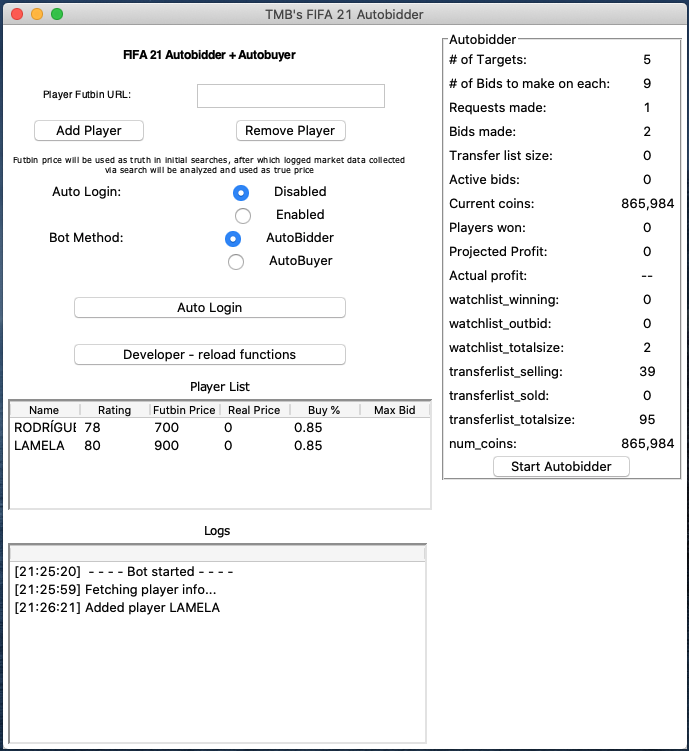
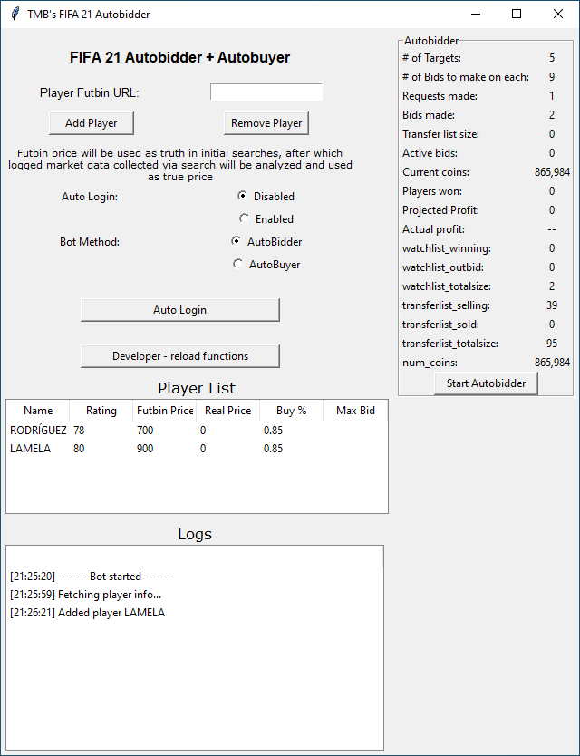

# TMB's FIFA 21 Autobidder

## Intro

_Note: I built this for me and my friends as a fun side project. I'm making it open source because it's awesome. This is/was my first project working with [Tkinter](https://wiki.python.org/moin/TkInter) as well as [Selenium WebDriver](https://www.selenium.dev/documentation/en/), a library that interacts with [ChromeDriver](https://www.chromium.org/). Shoutout to this botting community [Discord](https://discord.gg/gd9UqAtr)._

This project is an Autobidder trading bot that buys and sells players on the FUT (FIFA 21 Ultimate Team) Transfer Market.

Unlike the more common and widely known botting methods, such as [Autobuyers or snipers](https://github.com/chithakumar13/Fifa21-AutoBuyer) that rely on a combination of speed and luck (and riskily pushing the limits of EA's bot detection), Autobidding relies on lower margins at higher volumes - without any luck involved. This makes Autobidding not only more lucrative long term, but also more consistent, infinitely safer and more secure in comparison.

In fact, autobidding is the preferred botting method used by coin farmers working on industrial scales (this is actually a thing). The main reason autobidding is lesser known by the FIFA 21 botting community is simply because of its complexity to implement, relative to autobuying.

For example, an Autobuyer can be built with a simple "for" loop that clicks search, checks for a result, and tries again. An Autobidder requires managing multiple bidding wars in real time, knowing when to push back, and when to leave the table.

Used effectively, once your competitors give up trying to compete with a computer, the market is cornered and auctions will be won for significantly under market value. While everyone else is trying to snipe Ronaldo for 10k, and all of them competing with each other for the same snipe, small but consistent gains at scale will prevail (much like the S&P 500).

It is for these reasons I sought to create the ultimate Autobidder entirely on my own to maximize profits while also flying as low profile as possible.

Compared to an autobuyer, auto bidding excels in terms of:

- Consistency
  - Does not rely on luck, more importantly not competing with other bots (think of how many bots just searched for Ronaldo as you read this)
- Efficiency
  - Guaranteed profits since supply of undervalued auctions is infinitely greater than snipes
- Security / Detectability
  - Selenium's Javascript injection is the only indication of something 'off' - thankfully Selenium in itself is harmless, and no different than an Adblocker's injected Javascript
- Complexity
  - This was a lot of work so I hope someone finds this useful

## Overview

Mac             |  Windows
:-------------------------:|:-------------------------:
  |  

Built in Python, this bot uses [Selenium](https://www.selenium.dev/documentation/en/) to interact with FUT Webapp via [ChromeDriver](https://www.chromium.org/) and features a [Tkinter](https://wiki.python.org/moin/TkInter) User Interface for easy operation.

Unlike other bots, its operations can be monitored in real time, and appears identical to a human's actions. It is also safer than other Javascript injection bots, as the only Javascript injected is Selenium's, rendering EA's bot detection useless. Chromedriver flags have also been obfuscated, although the scale of EA's bot detection seems tiny so this is done out of an abundance of caution.

Features:

- Autobid on up to 5 players simultaneously
- Dynamic GUI displays logs and stats in real time from autobidder and autobuyer methods.
- All methods are threaded separately, so GUI is always active
- Optional AutoLogin + authentication code entry (requires enabling 3rd party access in Gmail)

[insert gif of autobidding]

Initial bids will reap low profit, but once you fight off other bidders, you have the player cornered. You will start winning players for 350 that you can sell for 800. These margins at high volumes reap ~30k coins an hour.

Project Structure

- Main.py is gui tkinter, creates selenium driver
- on button click, calls thread runner which creates autobidder. driver is passed along
- autobidder creates helper

The first step is logging in, either manually or automatically.

Once logged in, click the Start Autobidder button.

On the initial pass through the market, Futbin's price will be used as ceiling. During this time, all market data will be logged, and upon initial run's completion, parsed to determine the accurate market price. The Actual Market price will be used from then on.

## Installation

First, download a fresh version of Chromedriver straight from Google here (insert link) as it must match your machine's version of Chrome. Replace the existing chromedriver that matches your platform in either the chrome_linux, chrome_mac, or chrome_windows folders.

Navigate to the project's root directory via Terminal or Command Prompt, in this example it is on my Desktop.

Terminal:

```
cd ~/Desktop/FIFA21UTBOTv2
```

Command Prompt:
```
cd Desktop\FIFA21UTBOTv2
```

Then run the following to install Selenium and any other requirements (see [requirements.txt](./requirements.txt)): 

```
pip install -r requirements.txt
```

Make sure pip is installed (see here). If there are any errors, such as 'missing xyz module', simply ```pip install [xyz]```. Feel free to post an issue on this Repository and I'd be happy to trouble shoot. 

For any other errors, see *troubleshooting*.

## Troubleshooting

### Python

Python3 or greater is required to run the program. The most likely cause for errors is having an outdated Python version installed. To see your version of Python:

#### Mac

Open Terminal and type:

```
python --version
```

#### Windows

Open Command Prompt and type:

```
[to do - placeholder, sorry]
```

If you see Python 2.x, see [here](https://docs.python-guide.org/starting/install3/osx/) for installing Python 3.

If you know you have Python 3 installed, but see 2.x, your system's Python PATH must be assigned to Python 3.x. To do this, see [here](https://dev.to/malwarebo/how-to-set-python3-as-a-default-python-version-on-mac-4jjf) for Mac and [here](https://stackoverflow.com/questions/3701646/how-to-add-to-the-pythonpath-in-windows-so-it-finds-my-modules-packages) for Windows.

I suspect this will cause the biggest number of issues.

#### Chomedriver

If the bot is correctly starting, and you are sure Python is not the issue, then Chromedriver is the issue. The Chromedriver files (folder chrome_windows / chrome_mac) are the versions used by my system. In order for Chromedriver to work, it must match your systems version of Chrome. This can easily be fixed by redownloading Chromedriver.

Go [here](https://chromedriver.chromium.org/downloads) and download the latest release (Google will link you to the correct version). Replace the chromedriver in either the *chrome_windows* or *chrome_mac* with your download.

## Configuration

Everything is configured via the user interface.

To add a player, retrieve their Futbin (insert link) URL and click Add Player. The bot will automatically open the Futbin link and retrieve the data, which will populate in the table.

The maximum bid ceiling is hard set to 85%, and will be customizeable in a later update. The sell price is 95% of market price.

### Automatic login

If you would like to automatically login, enable Auto Login via the UI.

A *logins.txt* file will be created in the data folder, which must be structured like this:

```
1st line: Webapp email
2nd line: Webapp password
3rd line: Access code email
4th line: Access code password
```

Email credentials are necessary to fetch the authorization code.

**Remember to enable third party app access in Gmail, see [here](https://support.google.com/accounts/answer/3466521?hl=en_):**

## Running

**Linux/Mac systems**

In Terminal, run:

```
make run
```

See [troubleshooting] for help. 

**Windows**

Set the PYTHONPATH variable with the value of the code directory - [check this link](https://stackoverflow.com/questions/3701646/how-to-add-to-the-pythonpath-in-windows-so-it-finds-my-modules-packages).

Run:

```
python src\main.py
```

## Info

I encourage you to reach out with any errors, and would love contributors.

Good luck!


# To do

- update refresh page and go to watchlist method to not be on a timer
- make playerlist better interactable
- make player list not baked in stone upon starting autobidder
- add good compressed gifs
